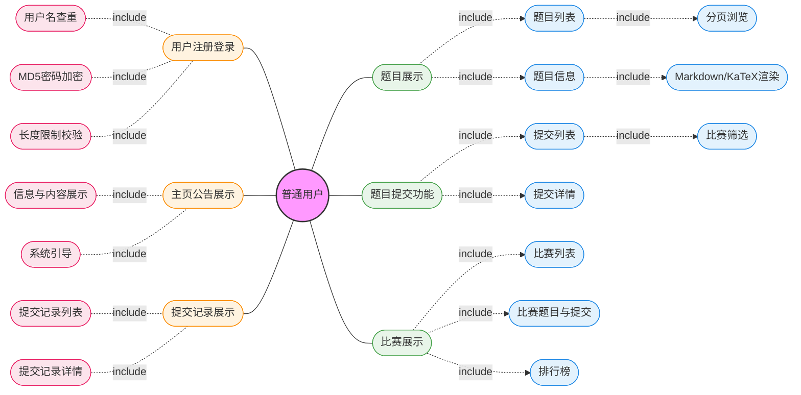
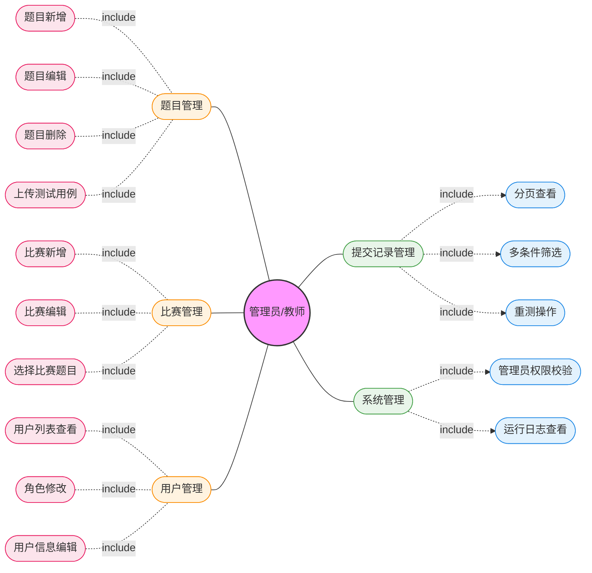
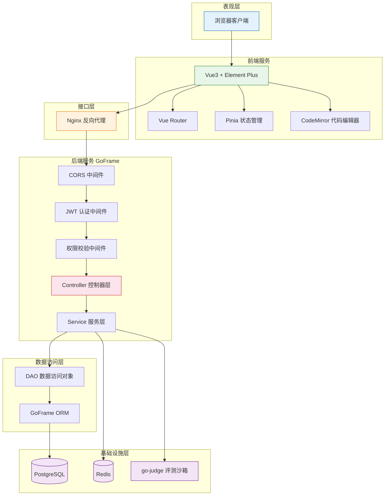
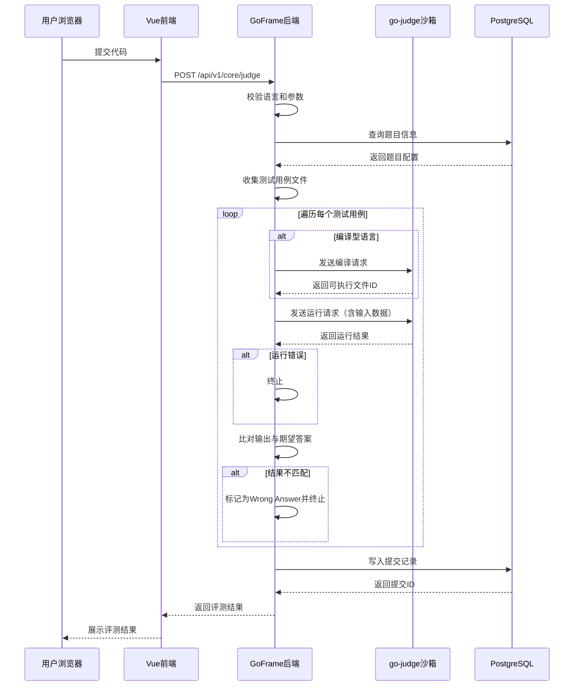
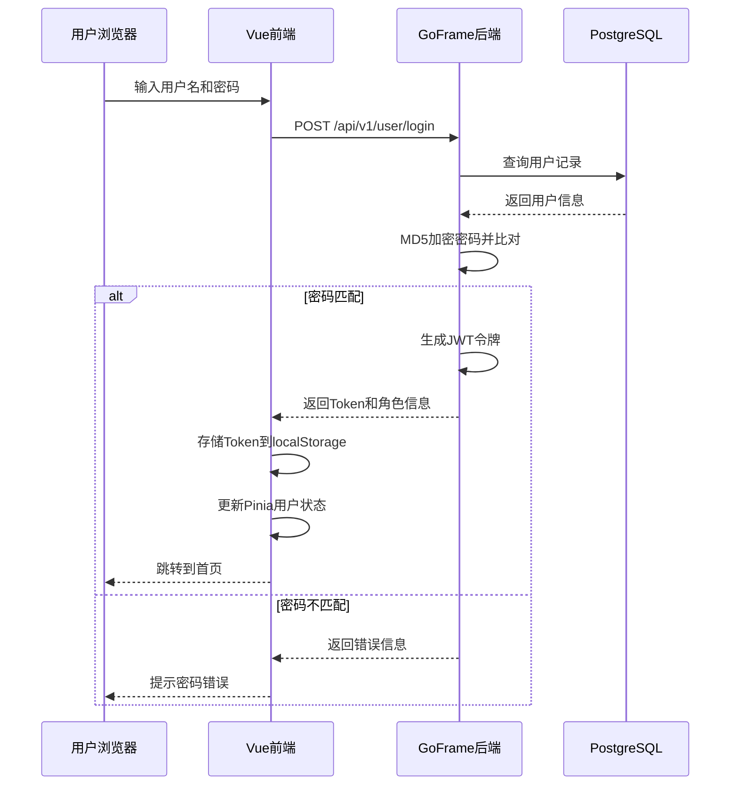
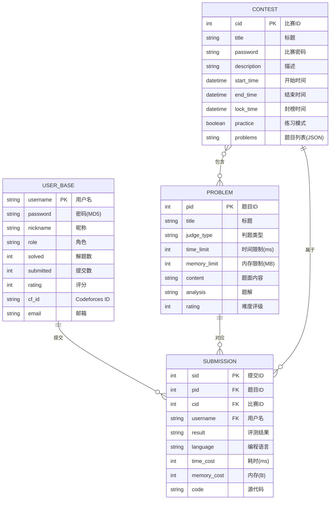

# **基于Go+Vue的智能在线评测系统的设计与实现**

**摘要：**本系统采用GoFrame框架搭建服务端后台，前端选用Vue3配合Element UI组件库进行开发，数据层依托PostgreSQL与Redis中间件构建存储体系。面向学生与教师群体，打造了一套完整的在线评测平台，涵盖试题库维护、竞赛活动组织、代码提交追踪、分级权限控制以及实时排名等核心模块。平台进一步引入大语言模型（LLM）能力，辅助学生进行代码诊断与算法学习，提升编程训练效率。运维层面结合1Panel管理面板，通过Docker容器化方案完成云端部署。实测数据表明，系统在功能完整性与交互体验上均达到预期，具有较好的实用价值与推广空间。

**关键词：**在线评测系统；GoFrame；Vue3；Docker；Postgres；Redis

# **Design and Implementation of an Intelligent Online Judge System Based on Go and Vue**

**Abstract**: This system employs the GoFrame framework for server-side backend development, with the frontend built using Vue3 and the Element UI component library. The data layer relies on PostgreSQL and Redis middleware to establish the storage infrastructure. Targeting students and instructors, a comprehensive online judge platform has been developed, encompassing core modules including problem set management, contest organization, submission tracking, tiered access control, and real-time leaderboards. The platform further integrates Large Language Model (LLM) capabilities to assist students with code diagnosis and algorithm learning, thereby enhancing programming training efficiency. For operations and maintenance, the system leverages the 1Panel management dashboard and utilizes Docker containerization for cloud deployment. Experimental results demonstrate that the system meets expectations regarding functional completeness and user experience, exhibiting promising practical value and scalability potential.

**Key words**: Online Judge System; GoFrame; Vue3; Docker; PostgreSQL; Redis

# 1 引言

随着人工智能的飞速发展和全球数字化转型的深入，编程能力已成为21世纪人才核心素养的重要组成部分。在高等教育及职业教育领域，程序设计类课程的教学需求已不满足传统的授课模式，其正面临前沿技术的深刻变革。在线评测系统（OnlineJudge，简称OJ）作为计算机科学教育中的核心基础设施，不仅为学生提供了实时反馈的编程练习平台，也为教师提供了高效的教学评价工具。

近年来，人工智能技术的爆发式增长，尤其是大语言模型（LLM）的成熟，正引领软件即服务（SaaS）系统向智能化深度演进。在教育科技领域，单纯的“代码提交-反馈结果”模式已难以满足现代学习者的个性化需求。引入AI辅助功能已成为OJ系统发展的必然趋势。通过构建智能编程助手，系统能够针对学生在解题过程中遇到的逻辑错误、语法障碍提供精准的启发式引导，实现个性化辅助教学。

此外，随着用户规模的扩大和历史提交数据的持续累积，传统的在线评测系统在应对高并发访问和海量数据检索时，往往暴露出性能瓶颈。部分现有系统在数据量激增的情况下，频繁出现页面加载缓慢、评测任务积压、数据库响应延迟等卡顿现象，严重影响了用户体验和教学进度。

基于此背景，本项目旨在设计并实现一个智能在线评测系统。该系统将采用主流的前后端分离技术栈，重点探索AI赋能下的交互式学习体验与智能化资源管理。同时，针对系统的高可用性与高性能需求，通过数据库索引优化、高效缓存策略及异步评测架构等技术手段，解决大规模数据下的性能劣化问题。本研究不仅有助于提升学校计算机编程教学的智能化水平，也为构建高性能、可扩展的教育SaaS平台提供了实践参考。

# 2 可行性分析

## 2.1 技术可行性

GoFrame作为社区开源框架，本身具备强大的功能和可维护性，也已经被多数实际运行项目验证其稳定可靠，适合用于做在线评测平台的服务器开发，Vue 3 的组合式 API 与高渲染性能，简化了复杂页面的交互与调试，使用开源框架Element-UI，可以快速构建简洁舒适的前端页面。配合 PostgreSQL 索引优化与 Redis 缓存机制，可有效解决大规模数据下的系统卡顿瓶颈，核心评测逻辑高度集成开源项目go-judge，该开源项目在多数大型算法竞赛（如CCPC）中验证过其可靠性，确保了代码运行的安全隔离与资源精准限制。可以通过调用Codeforces API对训练队员进行比赛、题目以及提交记录的获取，便于追踪训练进度。

该系统后端服务需要保证24小时在线，以便训练队员随时使用系统，部署使用的云服务器配置：

CPU：2核

内存：2GB

系统盘：40GB

限峰值带宽：3Mbps

部署环境：Ubuntu 24.04 LTS

## 2.2 经济可行性

本项目采用全栈开源技术方案，核心框架与组件均无商业授权费用，显著降低了初始构建成本。系统支持在校园局域网或低配云服务器上灵活部署，利用 Docker 等容器化技术可实现快速复用与环境迁移，大幅削减了运维人力支出。主要的经济投入仅限于服务器硬件资源或云端算力租赁，且可根据用户规模动态弹性调整，具有极高的性价比与经济合理性。

## 2.3 社会可行性

本项目紧扣教育数字化转型及高校编程教育智能化的发展趋势，满足了计算机专业教学改革与学生自主算法训练的社会需求。通过引入大语言模型（LLM）实现智能代码诊断，打破了传统评测系统“只判对错、不教方法”的局限，有效降低了编程学习门槛并提升了学习效率。系统结合 Go 语言的高并发特性与容器化部署方案，显著提升了实验教学与竞赛管理的运行效率，为编程训练指导提供了一种智能化、高效化的新模式，具有良好的社会应用与推广价值。

# 3 需求分析

需求分析是就是开发人员对系统实现的功能进行详细的调研分析，对用户的要求深入理解，进而确定系统必须完成什么工作的过程。

一个好的系统需要的是一个对用户友好的前端界面和逻辑严密的后端实现。系统需求的所有的功能，包括设计架构、用户的使用体验、实现难度，并且对于用户来说，是否满足在线学习的需求，是否易于维护等方面都要具体到每一个细节$^{[6]}$。

系统分为前后台服务，前台主要面向使用平台的学生，后台主要面向教师和系统管理员，我们分开分析需求。

## 3.1 前台需求分析

1. 用户注册登录：支持用户自定义用户名和密码，用户名作为唯一凭证需要进行数据库查重，用户名和密码均需要指定长度限制，密码使用 md5 加密后存储。
2. 主页公告展示：使用静态网页内容，可以作为信息展示，也可以作为内容展示，以系统引导和平台介绍为主。
3. 提交记录展示：包括提交记录列表，提交记录信息。
4. 题目展示：包括题目列表，题目信息。题目列表展示所有题目，显示题目 ID、标题、判题类型、难度评级，并支持分页浏览。题目信息展示题目标题、时间限制、内存限制、难度评级，题面内容支持 Markdown 渲染和 KaTeX 数学公式。
5. 题目提交功能：提供提交列表和提交详情两个页面。提交列表分页展示每次提交的摘要信息（提交编号、题目、用户、结果、语言、耗时、内存、时间），支持按比赛筛选。提交详情展示完整的提交信息包括源代码。
6. 比赛展示：提供比赛列表、比赛题目、比赛提交列表和比赛排行榜。比赛列表展示所有比赛的基本信息（编号、标题、时间、模式）。比赛详情页包含题目列表、提交记录、排行榜三个子模块。排行榜按通过题目数和罚时排名，每道题目显示通过状态，支持封榜功能。



## 3.2 后台需求分析

1. 题目管理：支持题目的新增、编辑、删除。新增题目需填写标题、判题类型、时间限制、内存限制、难度评级和题目内容，支持上传测试用例。
2. 比赛管理：支持比赛的新增和编辑。需填写标题、描述、比赛时间、封榜时间、比赛密码、比赛模式，以及从题库中选择比赛题目。
3. 用户管理：查看所有注册用户列表，支持修改用户角色和编辑用户基本信息。
4. 提交记录管理：分页查看所有提交记录，支持多条件筛选和重测操作。
5. 系统管理：管理员权限校验，确保仅管理员可访问后台。系统运行日志按日期存储，支持查看。



# 4 开发工具及相关技术

本章对系统开发过程中所采用的关键技术与工具进行系统阐述，涵盖后端服务框架、前端技术栈、数据存储方案、容器化部署以及评测沙箱引擎等核心组件，为后续章节的系统设计与实现奠定技术基础。

## 4.1 Go语言与GoFrame框架

Go语言（又称Golang）是由Google于2009年推出的一种静态类型、编译型编程语言。Go语言在设计之初便以简洁、高效和并发为核心目标，其语法精炼且易于学习，编译速度极快，生成的可执行文件为单一二进制产物，无需额外运行时依赖，极大地简化了部署流程。Go语言原生支持goroutine轻量级线程与channel通信机制，使开发者能够以极低的成本构建高并发网络服务，这一特性使其在云计算、微服务及Web后端开发领域获得了广泛应用。本系统后端服务选用Go 1.24作为开发语言版本，充分利用其并发模型处理多用户同时提交代码的评测请求场景。

GoFrame是一款基于Go语言的开源企业级Web开发框架，当前系统采用GoFrame v2版本。该框架遵循模块化设计理念，提供了一系列开箱即用的组件，包括对象关系映射（ORM）、HTTP路由与中间件、配置管理、日志记录、国际化支持等。GoFrame采用经典的MVC（Model-View-Controller）分层架构，通过工程化脚手架工具可快速生成标准化的项目目录结构，使控制器层、业务逻辑层、数据访问层各司其职，有效提升了代码的可维护性与团队协作效率。在本系统中，GoFrame承担了API路由注册、请求参数校验、数据库操作封装、中间件管理等核心职责，为整个后端服务提供了稳固的基础架构支撑。

在用户身份认证方面，本系统基于JSON Web Token（JWT）机制实现无状态的身份验证方案$^{[14]}$。JWT是一种开放标准（RFC 7519），通过在客户端与服务器之间传递经过数字签名的令牌来完成身份凭证的传递与验证。系统采用HS256对称加密算法对令牌进行签名，用户登录成功后由服务端签发包含用户标识的JWT令牌，客户端在后续请求中通过HTTP请求头携带该令牌，服务端中间件对令牌进行解析与校验，从而实现用户身份的持续认证，避免了传统Session方案中服务器端状态存储的开销。

## 4.2 Vue3前端技术栈

Vue.js是一款用于构建用户界面的渐进式JavaScript框架，由尤雨溪于2014年首次发布。Vue3作为该框架的最新主要版本，在架构层面进行了全面重构，引入了Composition API（组合式API）作为核心编程范式。相较于Vue2的Options API，Composition API允许开发者以函数为组织单元，将相关联的响应式状态、计算属性和副作用逻辑聚合在一起，显著提升了代码在复杂组件中的可读性与复用性$^{[4][7]}$。Vue3还基于ES6 Proxy重新实现了响应式系统，相较Vue2基于Object.defineProperty的实现，不仅消除了对动态属性添加和数组变更的检测限制，还带来了更优的运行时性能。本系统前端基于Vue 3.5版本进行开发，采用`<script setup>`语法糖编写单文件组件，以获得更简洁的模板语法和更优的编译时优化。

TypeScript是由Microsoft开发的一种开源编程语言，在JavaScript基础上增加了静态类型系统。本系统在全部前端代码中引入TypeScript，通过编译期类型检查有效减少运行时错误，同时借助IDE的智能提示能力显著提升开发效率。项目配合Vue TSC工具在构建阶段执行类型校验，确保代码的类型安全性。

在UI组件层面，系统选用Element Plus作为基础组件库。Element Plus是专门为Vue3设计的企业级组件库，提供了表单、表格、对话框、分页、导航等数十种高质量的可复用组件，支持主题定制与国际化配置。本系统将Element Plus的语言包设置为中文（zh-CN），并通过其丰富的布局与交互组件快速构建了后台管理界面和前台展示页面的整体视觉框架。

在状态管理方面，系统采用Pinia作为全局状态管理方案。Pinia是Vue官方推荐的新一代状态管理库，相较于Vuex，它摒弃了mutation的概念，提供了更简洁直观的API设计，天然支持TypeScript类型推导，并基于Vue3的响应式系统实现状态的自动更新。本系统通过Pinia管理用户登录状态、角色权限等全局共享数据。

在代码编辑器方面，系统集成了CodeMirror 6作为在线代码编写组件。CodeMirror是一款成熟的Web端文本编辑器，其第六代版本采用模块化架构，支持语法高亮、代码折叠、自动补全等编辑器核心功能。本系统为CodeMirror配置了C/C++、Java、Python等编程语言的语法支持，并选用One Dark主题以提供舒适的代码阅读体验。此外，题面内容的渲染采用Marked作为Markdown解析引擎，配合DOMPurify进行HTML净化以防范XSS攻击，数学公式则通过KaTeX进行高性能的客户端渲染，三者协同实现了题面中文字、代码、数学公式的富文本展示。整个前端项目基于Vite构建工具进行开发与打包，利用其基于原生ES模块的开发服务器实现毫秒级的热更新响应。

## 4.3 数据库技术

本系统的数据存储层采用PostgreSQL与Redis双引擎协同的架构方案，分别承担持久化存储与高速缓存的职责。

PostgreSQL是一款功能强大的开源对象关系型数据库管理系统，以其对SQL标准的严格兼容、丰富的数据类型支持和卓越的扩展性著称。PostgreSQL支持B-tree、Hash、GIN、GiST等多种索引类型，开发者可根据查询模式灵活选择最优索引策略，从而在大数据量场景下保持稳定的查询性能。此外，PostgreSQL提供了完善的事务隔离机制、行级锁粒度以及表分区等企业级特性，能够胜任高并发读写场景下的数据一致性保障$^{[11]}$。本系统使用PostgreSQL作为主数据库存储用户信息、题目数据、比赛记录、提交记录等核心业务数据，并通过GoFrame内置的ORM组件实现数据库操作的抽象封装，利用框架自动生成的数据访问对象（DAO）层完成模型与数据表之间的映射，有效降低了SQL编写的复杂度。

Redis是一款基于内存的高性能键值存储中间件，支持字符串、哈希、列表、集合、有序集合等多种数据结构。由于其全部数据驻留内存的特性，Redis能够提供亚毫秒级别的读写延迟，被广泛应用于缓存、会话管理、排行榜、消息队列等场景。在本系统中，Redis主要承担热数据的缓存职责，将高频访问的题目信息、比赛排行榜等数据缓存至内存中，减少对PostgreSQL的直接查询压力。GoFrame框架通过统一的`g.Redis()`接口封装了Redis客户端的连接管理与命令操作，使业务层能够以一致的API风格透明地切换或组合使用数据库与缓存。

## 4.4 Docker容器化部署

Docker是一种基于操作系统级虚拟化技术的容器化平台，通过将应用程序及其全部依赖环境打包为标准化的容器镜像，实现了"一次构建，到处运行"的部署理念。相较于传统虚拟机方案，Docker容器共享宿主机操作系统内核，无需启动完整的客户操作系统，因此具有启动速度快、资源占用低、部署密度高的显著优势。Docker Compose作为Docker官方的多容器编排工具，允许开发者通过声明式的YAML配置文件定义和管理局多服务的启动顺序、网络拓扑与数据卷挂载，使包含多个微服务的复杂应用能够在单条命令下完成完整的部署流程$^{[6]}$。

本系统的生产环境部署采用Docker容器化方案，各服务组件运行于独立的容器实例中，包括Go后端服务、Vue前端静态资源服务、PostgreSQL数据库、Redis缓存以及go-judge评测沙箱，通过Docker Compose统一编排各容器的启动依赖与网络通信。运维层面借助1Panel开源服务器管理面板进行可视化的容器状态监控、日志查看与资源管理，降低了服务器运维的操作门槛。整套系统部署于Ubuntu 24.04 LTS操作系统的云服务器上，通过容器化技术实现了开发环境与生产环境的高度一致性，有效避免了因环境差异导致的部署问题。

## 4.5 go-judge评测沙箱

go-judge是一款由开源社区维护的程序评测沙箱引擎，专为在线评测系统设计，用于在受控环境下安全地编译和执行用户提交的源代码。该引擎基于Linux内核的namespace和cgroup机制实现进程级别的资源隔离：通过namespace隔离文件系统、进程ID、网络等系统资源的可见性，确保用户代码在受限的沙箱环境中运行，无法访问宿主机的敏感资源；通过cgroup对CPU时间、内存用量、进程数量等计算资源施加精确的硬性限制，防止单次评测任务因死循环或内存泄漏而影响系统整体稳定性。

本系统通过Docker容器方式部署go-judge服务，后端通过HTTP协议与评测沙箱进行通信。用户提交代码后，系统将源代码连同编译执行指令发送至go-judge接口，沙箱在隔离环境中完成代码的编译与运行，并将标准输出、运行耗时、内存峰值等信息返回给后端，由判题模块将运行结果与标准答案进行比对，最终判定评测结果。系统当前支持C（gcc编译器）、C++（g++编译器）、Java（javac/jdk）和Python（python3）四种主流编程语言的评测，并针对不同语言设定了相应的资源限制参数（默认CPU时间上限10秒、内存上限256MB），在保证评测公平性的同时兼顾系统安全性。go-judge已在包括中国大学生程序设计竞赛（CCPC）在内的多项大型算法竞赛中作为评测核心投入实际使用，其可靠性和稳定性得到了充分的工程验证$^{[16]}$。

## 4.6 AI辅助开发工具

在系统开发过程中，本项目的编码、调试与数据库管理等工作广泛借助了AI辅助开发工具，显著提升了开发效率与代码质量。核心开发辅助工具为Claude Code，这是由Anthropic公司推出的命令行智能编程助手，基于大语言模型提供代码生成、重构建议、错误诊断、项目理解等能力。Claude Code通过Skills机制和MCP（Model Context Protocol，模型上下文协议）协议实现与外部工具和服务的深度集成，使其能够超越单纯的文本生成，直接参与代码编辑、浏览器调试、数据库查询等实际开发操作。

在Skills层面，本项目配置了goframe-v2与vue-best-practices两项专业技能模块。goframe-v2 Skill内化了GoFrame框架的API约定、路由注册方式、ORM操作规范及项目目录结构等领域知识，使AI助手在编写后端代码时能够严格遵循框架的最佳实践，自动匹配正确的组件调用方式和错误处理模式。vue-best-practices Skill则封装了Vue3组合式API、TypeScript集成、Pinia状态管理等前端开发规范，确保生成的Vue组件符合`<script setup>`语法标准和响应式编程范式。这两项Skill的协同作用使AI助手能够同时理解前后端的技术约束，在涉及API对接的跨栈开发场景中保持代码风格的一致性。

在MCP协议层面，本项目通过配置三个MCP Server实现了AI助手对运行时环境的直接交互能力。Chrome DevTools MCP Server建立了与Chrome浏览器的远程调试连接，使AI助手能够通过程序化接口执行页面导航、元素截图、JavaScript代码注入等操作，在前端界面开发过程中实现了"编写代码—浏览器验证—发现问题—即时修复"的快速迭代闭环。PostgreSQL MCP Server提供了对生产数据库的只读SQL查询通道，AI助手可在开发过程中直接检索数据库中的表结构与业务数据，无需开发者手动切换至数据库客户端即可完成数据验证与查询调试。此外，开发中还配合使用psql命令行工具对数据库进行交互式管理，包括数据导入导出、索引创建与Schema变更等运维操作，作为MCP查询通道的补充手段。同时，项目还配置了gopls语言服务器插件，为AI助手提供Go语言的代码导航、类型推断与定义跳转等静态分析能力，进一步提升了后端代码的编写精度。

通过上述AI辅助开发工具链的引入，本项目在开发阶段实现了人机协作的编程模式：开发者负责系统架构决策与业务逻辑设计，AI助手承担代码实现、接口对接、调试验证等具体执行工作，二者优势互补，在保证代码质量的同时有效缩短了开发周期。

# 5 系统设计

本章从系统总体架构、功能模块划分、核心业务流程建模以及数据库设计四个层面，对智能在线评测系统进行系统性的设计阐述。

## 5.1 系统总体架构设计

本系统采用经典的B/S（Browser/Server）架构模式，基于前后端分离的开发范式进行设计。整体架构分为表现层、接口层、业务逻辑层、数据访问层和基础设施层五个层次，各层职责清晰、松耦合协作。



如上图所示，系统整体架构的请求流转过程如下：

用户通过浏览器访问前端页面，前端基于Vue3框架构建单页应用（SPA），通过Vue Router管理页面路由，Pinia管理全局状态。用户操作触发HTTP请求后，请求经Nginx反向代理转发至后端GoFrame服务。后端服务依次经过CORS跨域中间件、JWT身份认证中间件和权限校验中间件的层层过滤，到达对应的Controller控制器。控制器调用Service服务层完成业务逻辑处理，服务层通过DAO数据访问对象与PostgreSQL数据库交互，同时可借助Redis缓存提升热点数据查询性能。评测类请求则由服务层通过HTTP协议调用独立部署的go-judge评测沙箱服务完成代码编译与执行。

## 5.2 系统功能模块设计

根据需求分析，系统功能模块按角色划分为前台用户模块和后台管理模块两大类。

前台用户模块面向学生群体，提供题库浏览、代码提交、比赛参与等核心学习功能。后台管理模块面向教师和系统管理员，提供题目维护、比赛组织、用户管理等运营管理功能。各模块的具体功能职责如下：

**前台用户模块：**

1. 用户注册登录：支持用户名密码注册，密码经MD5加密存储，登录后签发JWT令牌维持会话状态。
2. 题目浏览：展示题库列表，支持分页浏览，题目详情页支持Markdown渲染和KaTeX数学公式展示。
3. 代码提交与评测：集成CodeMirror代码编辑器，支持C、C++、Java、Python四种编程语言的在线提交与代码高亮显示，提交后由go-judge沙箱执行评测并返回结果。
4. 提交记录查看：展示用户的历史提交记录列表和提交详情，包括源代码、运行结果、耗时和内存消耗等信息。
5. 比赛参与：展示比赛列表及比赛详情，比赛期间可提交代码，支持按比赛筛选提交记录。
6. 排行榜查看：比赛排行榜按通过题目数和罚时排名，展示每位参赛者各题的通过状态。

**后台管理模块：**

1. 题目管理：支持题目的新增、编辑和删除，新增时需填写标题、判题类型、时间限制、内存限制、难度评级和题面内容，并支持上传测试用例文件。
2. 比赛管理：支持比赛的新增和编辑，需填写比赛标题、描述、比赛时间区间、封榜时间、比赛密码及比赛模式，并可从题库中选择比赛题目。
3. 用户管理：查看所有注册用户列表，支持修改用户角色和编辑用户基本信息。
4. 提交记录管理：分页查看所有用户的提交记录，支持多条件筛选。

## 5.3 UML建模设计

本节选取"代码评测"和"用户登录"两个核心业务流程，通过时序图展示系统各组件间的交互细节。

**代码评测流程：**

代码评测是在线评测系统的核心业务，涉及前端、后端服务层、评测沙箱和数据库四个参与者的协作。



评测流程的关键设计点在于：编译型语言（C/C++/Java）先编译后运行，编译产物通过文件ID缓存在go-judge中，避免每个测试用例重复编译；系统对每个测试用例逐一执行并比对输出，一旦出现答案错误立即终止评测，节省计算资源；最终将所有测试用例中的最大运行时间和最大内存消耗作为该次提交的资源指标记录到数据库中。

**用户登录流程：**



## 5.4 数据库设计

本系统使用PostgreSQL作为主数据库，共设计4张核心业务表：用户表（user_base）、题目表（problem）、比赛表（contest）和提交记录表（submission）。

**E-R图：**



实体间关系说明：一个用户可以提交多次代码（一对多）；一道题目可以有多条提交记录（一对多）；一场比赛可以有多条提交记录（一对多）；一场比赛与多道题目之间为多对多关系，通过contest表的problems字段以JSON数组形式存储关联关系。

对用户表（user_base）的详细设计如表5.1所示。

表5.1 user_base用户表

| 字段名 | 数据类型 | 长度 | 约束 | 说明 |
|--------|----------|------|------|------|
| username | varchar | 50 | 主键 | 用户名，唯一标识 |
| password | varchar | 64 | 非空 | MD5加密后的密码 |
| nickname | varchar | 50 | | 用户昵称 |
| role | varchar | 20 | 非空 | 用户角色（locked/user/admin/root） |
| solved | integer | | 默认0 | 已通过题目数 |
| submitted | integer | | 默认0 | 总提交次数 |
| rating | integer | | 默认0 | 用户评分 |
| cf_id | varchar | 50 | | Codeforces平台ID |
| atc_id | varchar | 50 | | AtCoder平台ID |
| ext | text | | | 扩展信息(JSON) |

对题目表（problem）的详细设计如表5.2所示。

表5.2 problem题目表

| 字段名 | 数据类型 | 长度 | 约束 | 说明 |
|--------|----------|------|------|------|
| pid | serial | | 主键，自增 | 题目ID |
| title | varchar | 100 | 非空 | 题目标题 |
| judge_type | varchar | 30 | 非空 | 判题类型（Standard/Special Judge等） |
| time_limit | integer | | 非空 | 时间限制（毫秒） |
| memory_limit | integer | | 非空 | 内存限制（MB） |
| rating | integer | | 默认0 | 难度评级 |
| content | text | | | 题面内容（Markdown格式） |
| analysis | text | | | 题解内容（Markdown格式） |
| create_by | varchar | 50 | | 创建者用户名 |

对比赛表（contest）的详细设计如表5.3所示。

表5.3 contest比赛表

| 字段名 | 数据类型 | 长度 | 约束 | 说明 |
|--------|----------|------|------|------|
| cid | serial | | 主键，自增 | 比赛ID |
| title | varchar | 100 | 非空 | 比赛标题 |
| password | varchar | 50 | | 比赛参赛密码 |
| description | text | | | 比赛描述 |
| start_time | timestamp | | 非空 | 比赛开始时间 |
| end_time | timestamp | | 非空 | 比赛结束时间 |
| lock_time | timestamp | | | 封榜时间 |
| practice | boolean | | 默认false | 是否为练习模式 |
| problems | text | | | 比赛题目ID列表（JSON数组） |
| create_by | varchar | 50 | | 创建者用户名 |

对提交记录表（submission）的详细设计如表5.4所示。

表5.4 submission提交记录表

| 字段名 | 数据类型 | 长度 | 约束 | 说明 |
|--------|----------|------|------|------|
| sid | serial | | 主键，自增 | 提交ID |
| pid | integer | | 外键 | 题目ID |
| cid | integer | | | 比赛ID（非比赛提交时为空） |
| username | varchar | 50 | 外键 | 提交者用户名 |
| result | varchar | 30 | 非空 | 评测结果（Accepted/Wrong Answer等） |
| language | varchar | 20 | 非空 | 编程语言（cpp/c/java/python） |
| time_cost | integer | | | 运行耗时（毫秒） |
| memory_cost | bigint | | | 内存消耗（字节） |
| code | text | | 非空 | 提交的源代码 |

数据库设计中所有业务表均包含create_at、update_at、delete_at三个时间戳字段，其中delete_at用于实现软删除机制，GoFrame框架在执行查询时自动过滤delete_at不为空的记录，无需在业务代码中手动添加条件判断。

# 6 系统功能实现

本章结合系统核心功能模块，阐述前后端的具体实现方式与关键代码逻辑。

## 6.1 开发环境说明

系统开发所使用的核心框架、工具及版本信息如下表所示：

| 类别 | 技术/工具 | 版本 | 用途 |
|------|-----------|------|------|
| 后端语言 | Go | 1.24.1 | 服务端开发 |
| 后端框架 | GoFrame | v2.10.0 | Web框架与ORM |
| 前端框架 | Vue | 3.5.19 | 单页应用开发 |
| 前端构建 | Vite | 7.x | 前端构建工具 |
| UI组件库 | Element Plus | 2.10.7 | 前端UI组件 |
| 状态管理 | Pinia | 3.0.3 | 全局状态管理 |
| 类型系统 | TypeScript | 5.x | 前端类型安全 |
| 数据库 | PostgreSQL | 16.x | 关系型数据存储 |
| 缓存 | Redis | 8.6.1 | 热数据缓存 |
| 评测沙箱 | go-judge | latest | 代码编译与执行 |
| 容器化 | Docker Compose | - | 服务编排部署 |
| IDE | GoLand / VS Code | - | 集成开发环境 |
| 版本控制 | Git | - | 源代码管理 |

## 6.2 管理端/用户端模块实现

### 6.2.1 用户注册登录模块

用户登录页面提供用户名和密码输入框，用户输入凭证后点击登录按钮，前端通过Axios发起POST请求至后端`/api/v1/user/login`接口。

后端登录控制器的核心逻辑如下：首先根据用户名查询数据库，判断用户是否存在；若存在，则将用户提交的密码进行MD5加密后与数据库中存储的加密密码进行比对；密码匹配后，调用`GenToken`函数生成JWT令牌，令牌载荷包含用户名和角色信息，使用HS256算法签名，并返回给前端。

```go
func (c *ControllerUser) Login(ctx context.Context, req *user.LoginReq) (res *user.LoginRes, err error) {
    md := dao.UserBase.Ctx(ctx)
    // 检查用户是否存在
    cnt, err := md.Where("username", req.Username).Count()
    if err != nil || cnt == 0 {
        return nil, gerror.NewCode(gcode.CodeInvalidRequest)
    }
    // 查询用户记录
    e := &entity.UserBase{}
    err = md.Where("username", req.Username).Scan(e)
    // MD5加密后比对密码
    md5Password, err := gmd5.Encrypt(req.Password)
    if e.Password != md5Password {
        return nil, gerror.NewCode(gcode.CodeInvalidRequest, "密码错误")
    }
    // 生成JWT令牌
    token, err := middleware.GenToken(req.Username, e.Role)
    res.Token = token
    return res, nil
}
```

前端接收到Token后，将其存储到浏览器localStorage中，并同步更新Pinia用户状态管理store。后续所有需要认证的请求均通过Axios请求拦截器自动在Header中添加`Authorization: Bearer <token>`字段。后端通过JWTAuth中间件对管理端接口进行令牌校验，解析出用户名和角色信息后注入请求上下文，供后续的权限校验中间件使用。

### 6.2.2 题目展示与提交评测模块

题目列表页面通过`GET /api/v1/problem/get-page`接口获取分页数据，使用Element Plus的el-table组件展示题目ID、标题、判题类型、难度评级等信息。题目详情页通过`GET /api/v1/problem/get-info`接口获取完整题目信息，题面内容使用Marked库渲染Markdown，配合KaTeX渲染数学公式。

代码提交功能的实现是系统的核心环节。用户在题目详情页通过CodeMirror编辑器编写代码，选择编程语言后点击提交。前端将代码、题目ID和语言类型发送至`POST /api/v1/core/judge`接口。后端评测控制器的处理流程如下：

```go
func (c *ControllerCore) Judge(ctx context.Context, req *core.JudgeReq) (res *core.JudgeRes, err error) {
    // 1. 校验编程语言是否支持
    if _, ok := service.LanguageConfigs[req.Language]; !ok {
        return nil, gerror.NewCode(gcode.CodeInvalidRequest, "不支持的语言")
    }
    // 2. 查询题目信息
    problem := &entity.Problem{}
    err = dao.Problem.Ctx(ctx).Where("pid", req.Pid).Scan(problem)
    // 3. 收集测试用例
    testCases, err := service.CollectTestCases(pid)
    // 4. 逐个测试用例执行评测
    result := enums.JudgeStatusAccepted
    for _, testCase := range testCases {
        exeRes, _ := service.ExecuteCode(ctx, &service.ExecuteCodeRequest{
            Code: req.Code, Input: input, Language: req.Language,
        })
        // 5. 比对输出结果
        if !utils.IsOutputEqual(exeRes.Output, expected) {
            result = "Wrong Answer"
            break
        }
    }
    // 6. 写入提交记录
    dao.Submission.Ctx(ctx).Data(data).InsertAndGetId()
    return res, nil
}
```

评测服务层负责与go-judge沙箱的通信。对于编译型语言（C、C++、Java），首先发送编译请求获取可执行文件ID，随后将该ID作为缓存文件引用发送运行请求，避免每个测试用例重复编译。系统支持四种编程语言，配置如下：

```go
var LanguageConfigs = map[enums.Language]LanguageConfig{
    "cpp": {
        CompileCmd: []string{"/usr/bin/g++", "main.cpp", "-o", "main"},
        RunCmd:     []string{"main"},
    },
    "c": {
        CompileCmd: []string{"/usr/bin/gcc", "main.c", "-o", "main"},
        RunCmd:     []string{"main"},
    },
    "java": {
        CompileCmd: []string{"/usr/bin/javac", "Main.java"},
        RunCmd:     []string{"/usr/bin/java", "Main"},
    },
    "python": {
        RunCmd: []string{"/usr/bin/python3", "main.py"},
    },
}
```

评测过程中的资源限制通过go-judge的cgroup机制强制执行，默认CPU时间上限10秒、内存上限256MB、最大进程数10、输出上限10KB，确保用户代码在安全的沙箱环境中运行。

### 6.2.3 比赛与排行榜模块

比赛列表页面展示所有比赛的基本信息，包括比赛编号、标题、比赛时间和比赛模式。比赛详情页采用嵌套路由设计，包含题目列表、提交记录和排行榜三个子页面。

排行榜是比赛模块的核心功能，其算法基于ACM/ICPC竞赛规则实现：按通过题目数降序排列，通过数相同时按罚时升序排列。罚时计算方式为已通过题目的提交时间（分钟数）加上每道题错误提交次数乘以20分钟的惩罚时间。

```go
func Ranking() {
    // 按 Username 计算成绩
	ranking := make(map[string]*contest.RankingItem)
	for _, sub := range submissionData {
		index := order[gconv.Int(sub.ProblemId)]
		rankingRow := ranking[sub.Username]
		if rankingRow == nil {
			rankingRow = &contest.RankingItem{
				Username: sub.Username,
				Score:    0,
				Penalty:  0,
				Problems: make([]contest.ProblemStatsItem, len(problems)),
			}
			ranking[sub.Username] = rankingRow
		}
		if rankingRow.Problems[index].Status != enums.RankingStatusAccepted {
			if sub.Result == string(enums.JudgeStatusAccepted) {
				rankingRow.Score++
				finishTime := int(sub.CreateAt.Sub(contestInfo.StartTime).Minutes())
				rankingRow.Problems[index].FinishTime = finishTime
				rankingRow.Penalty += finishTime + consts.DEFAULT_PENALTY*rankingRow.Problems[index].RejectCount
				rankingRow.Problems[index].Status = enums.RankingStatusAccepted
			} else {
				rankingRow.Problems[index].RejectCount++
				rankingRow.Problems[index].Status = enums.RankingStatusReject
			}
		}
	}
}
```

### 6.2.4 后台管理模块

后台管理界面通过Vue Router的路由守卫实现权限控制。路由配置中为管理端路由添加`meta: { requiresAdmin: true }`元信息，全局前置守卫在访问管理端页面前检查用户登录状态和角色权限，未授权用户自动重定向至首页。

后端管理端接口统一注册在`/admin`路由组下，依次经过CORS中间件、日志中间件、JWTAuth认证中间件和PermissionAuth权限校验中间件。JWTAuth中间件从请求头提取Token并验证签名合法性，PermissionAuth中间件从上下文中获取用户名并在数据库中确认用户存在且具备管理权限。

题目管理页面支持题目的新增和编辑操作。新增题目时需填写标题、判题类型、时间限制、内存限制、难度评级和Markdown格式的题面内容，并可上传测试用例文件（.in/.out格式配对）。测试用例文件按题目ID存储在服务器的指定目录下，评测时由系统自动扫描并加载。

# 7 系统功能测试

## 7.1 测试环境与方法

系统功能测试在以下软硬件环境中进行：

| 项目 | 配置 |
|------|------|
| 操作系统 | Windows 11 |
| 浏览器 | Google Chrome 134 |
| 后端服务 | Go 1.24.1 + GoFrame v2 |
| 数据库 | PostgreSQL 16 |
| 缓存 | Redis 8.6.1 |
| 评测沙箱 | go-judge (Docker容器) |
| 前端开发服务器 | Vite Dev Server (localhost:5173) |
| 后端接口地址 | localhost:8000 |

测试方法采用黑盒测试与白盒测试相结合的策略。黑盒测试从用户视角出发，验证各功能模块的输入输出是否符合预期；白盒测试关注后端接口的参数校验、异常处理和边界条件。针对登录认证、代码评测、权限控制等关键功能编写专项测试用例，确保系统在正常流程和异常输入下均能正确响应。

## 7.2 测试用例编写

下表列出了系统核心功能的测试用例及执行结果：

**用户注册登录测试：**

| 用例编号 | 测试场景 | 操作步骤 | 预期结果 | 实际结果 | 结论 |
|----------|----------|----------|----------|----------|------|
| TC-01 | 正常注册 | 输入合法用户名和密码，点击注册 | 注册成功，跳转至登录页 | 与预期一致 | 通过 |
| TC-02 | 重复用户名注册 | 输入已存在的用户名，点击注册 | 提示"存在重名用户" | 与预期一致 | 通过 |
| TC-03 | 正常登录 | 输入正确的用户名和密码，点击登录 | 登录成功，返回Token，跳转首页 | 与预期一致 | 通过 |
| TC-04 | 错误密码登录 | 输入正确用户名和错误密码，点击登录 | 提示"密码错误" | 与预期一致 | 通过 |
| TC-05 | 不存在的用户登录 | 输入未注册的用户名，点击登录 | 提示请求错误 | 与预期一致 | 通过 |

**题目与评测测试：**

| 用例编号 | 测试场景 | 操作步骤 | 预期结果 | 实际结果 | 结论 |
|----------|----------|----------|----------|----------|------|
| TC-06 | 题目列表加载 | 访问题目列表页 | 分页展示题目信息（ID、标题、类型、难度） | 与预期一致 | 通过 |
| TC-07 | 题目详情展示 | 点击某道题目进入详情页 | 正确渲染Markdown题面和数学公式 | 与预期一致 | 通过 |
| TC-08 | 正确代码提交 | 提交通过所有测试用例的C++代码 | 返回Accepted，记录耗时和内存 | 与预期一致 | 通过 |
| TC-09 | 错误代码提交 | 提交输出结果错误的C++代码 | 返回Wrong Answer | 与预期一致 | 通过 |
| TC-10 | 编译错误提交 | 提交语法错误的C++代码 | 返回Compile Error | 与预期一致 | 通过 |
| TC-11 | 不支持的语言 | 选择不支持的编程语言提交 | 返回"不支持的语言"错误 | 与预期一致 | 通过 |
| TC-12 | Python代码提交 | 提交正确答案的Python代码 | 返回Accepted | 与预期一致 | 通过 |

**比赛与排行榜测试：**

| 用例编号 | 测试场景 | 操作步骤 | 预期结果 | 实际结果 | 结论 |
|----------|----------|----------|----------|----------|------|
| TC-13 | 比赛列表加载 | 访问比赛列表页 | 分页展示比赛信息 | 与预期一致 | 通过 |
| TC-14 | 比赛题目查看 | 进入比赛详情页，查看题目列表 | 展示比赛包含的所有题目 | 与预期一致 | 通过 |
| TC-15 | 比赛提交评测 | 比赛期间提交代码 | 正常评测并记录到比赛提交列表 | 与预期一致 | 通过 |
| TC-16 | 排行榜排序 | 查看比赛排行榜 | 按通过数降序、罚时升序排列 | 与预期一致 | 通过 |
| TC-17 | 排行榜罚时计算 | 同一题目多次错误后通过 | 罚时包含错误次数×20分钟的惩罚 | 与预期一致 | 通过 |

**权限控制测试：**

| 用例编号 | 测试场景 | 操作步骤 | 预期结果 | 实际结果 | 结论 |
|----------|----------|----------|----------|----------|------|
| TC-18 | 未登录访问管理后台 | 未登录状态下访问/admin路由 | 重定向至登录页 | 与预期一致 | 通过 |
| TC-19 | 普通用户访问管理后台 | 以user角色登录后访问/admin | 重定向至首页 | 与预期一致 | 通过 |
| TC-20 | 管理员访问后台 | 以admin角色登录后访问/admin | 正常展示管理后台页面 | 与预期一致 | 通过 |
| TC-21 | 无Token调用管理接口 | 不携带Token调用/admin接口 | 返回"未提供token"错误 | 与预期一致 | 通过 |
| TC-22 | 伪造Token调用接口 | 携带伪造Token调用/admin接口 | 返回"不合法的token"错误 | 与预期一致 | 通过 |

上述测试用例覆盖了用户认证、核心业务流程和权限访问控制三个关键测试维度，共计22个测试用例全部通过，系统功能表现符合设计预期。

# 8 系统部署

本系统采用Docker容器化部署方案，将各服务组件打包为独立的容器实例，通过Docker Compose统一编排管理。生产环境部署于云服务器上，服务器配置为2核CPU、2GB内存、40GB系统盘、3Mbps峰值带宽，操作系统为Ubuntu 24.04 LTS。

后端服务的部署流程如下：首先在本地开发环境使用`go build`命令编译Go源码，生成单一二进制可执行文件。将该可执行文件、配置文件（config.yaml）及静态资源文件上传至服务器后，通过Dockerfile构建后端服务镜像。镜像基于Ubuntu基础镜像，安装PostgreSQL客户端依赖后，将编译产物复制到容器内，暴露8000端口作为HTTP服务端口。go-judge评测沙箱作为独立容器运行，使用`criyle/go-judge`官方镜像，开启特权模式以支持namespace和cgroup隔离机制，共享内存设置为256MB，暴露5050端口供后端服务调用。Redis缓存服务同样以独立容器运行，数据目录挂载至宿主机持久化存储。三个容器的编排通过docker-compose.yml配置文件统一管理：

```yaml
services:
  redis:
    image: redis:8.6.1
    container_name: redis
    restart: unless-stopped
    ports:
      - "6379:6379"
    volumes:
      - ./data:/data
  go-judge:
    image: criyle/go-judge
    container_name: go-judge
    restart: unless-stopped
    privileged: true
    shm_size: '256mb'
    ports:
      - "5050:5050"
```

前端部署方面，在本地执行`npm run build`命令完成Vue项目的编译打包，生成dist目录下的静态资源文件（HTML、JavaScript、CSS）。将静态文件上传至服务器后，配置Nginx作为反向代理服务器和静态资源服务器。Nginx的配置要点包括：将根路径指向前端静态资源目录，设置适当的缓存策略；将`/api`路径前缀的请求代理转发至后端服务的8000端口，实现前后端请求的统一入口管理。

运维层面，系统借助1Panel开源服务器管理面板进行可视化的容器状态监控、日志查看与资源管理。后端服务的运行日志通过GoFrame框架的日志组件按日期自动写入`output`目录，便于问题排查和运行状态审计。

# 9 结束语

## 9.1 工作总结

本文设计并实现了一个基于Go+Vue的智能在线评测系统，从需求分析、系统设计、编码实现到测试部署，完成了完整的软件开发全生命周期实践。系统采用前后端分离的技术架构，后端基于GoFrame框架构建RESTful API服务，前端基于Vue3和Element Plus组件库构建响应式单页应用，数据层采用PostgreSQL与Redis双引擎协同的存储方案，评测核心通过go-judge沙箱引擎实现代码的安全隔离执行。

系统实现了用户注册登录、题目管理与浏览、多语言代码提交与自动评测、比赛组织与管理、ACM赛制排行榜、分级权限控制等核心功能模块，基本满足了在线评测平台的教学与竞赛需求。在开发过程中，借助Claude Code等AI辅助开发工具提升了编码效率，通过Docker容器化方案简化了部署流程，验证了智能化开发工具与容器化运维在现代Web应用开发中的实践价值。

## 9.2 不足之处

受限于开发周期和个人技术能力，当前系统仍存在以下局限性：

1. **评测性能优化不足：** 当前评测流程为同步串行执行，即用户提交代码后需等待所有测试用例逐一执行完毕才能返回结果，在多用户同时提交的高并发场景下可能造成请求排队等待，影响用户体验。
2. **AI智能辅助功能尚未完善：** 系统规划中的大语言模型辅助代码诊断功能尚未实现，当前系统仍停留在传统的"提交-判题-反馈"模式，未能提供智能化的代码纠错与算法引导服务。
3. **题面管理能力有限：** 当前题目仅支持单题面展示，尚未实现多题面管理功能，无法灵活适配不同语言或不同版本的题面需求。
4. **比赛功能有待完善：** 比赛模块暂未实现比赛密码验证、比赛时间区间限制等安全校验逻辑，封榜功能的完整性仍需进一步完善。
5. **前端交互体验可优化：** 部分页面的加载性能和交互流畅度仍有提升空间，移动端适配尚未完成。

## 9.3 未来展望

针对上述不足，未来可从以下方向进行改进和扩展：

1. **引入消息队列实现异步评测：** 采用Redis Streams或RabbitMQ等消息队列中间件，将评测任务异步化处理，支持评测任务的并行调度与负载均衡，显著提升高并发场景下的系统吞吐能力。
2. **集成大语言模型实现智能辅助：** 接入大语言模型API，为用户提供代码错误诊断、算法思路提示、代码优化建议等智能化服务，将系统从单纯的评测工具升级为编程学习辅助平台。
3. **完善比赛管理与安全机制：** 增加比赛密码验证、IP白名单、比赛期间代码查重等安全功能，支持ICPC赛制和OI赛制的双模式切换，实现完整的封榜与滚榜功能。
4. **增强数据分析与可视化能力：** 利用用户提交数据构建学习画像，提供个人能力雷达图、题目难度分布统计、训练进度追踪等数据可视化功能，为教师教学提供数据支撑。
5. **探索微服务架构演进：** 将单体后端服务按业务域拆分为用户服务、题目服务、评测服务等独立微服务，通过服务注册与发现机制实现水平扩展，支撑更大规模的用户访问。

# 参考文献

[1] 李德光,李晓辉,张庆熙,等.面向Online Judge提交日志的用户编程行为可视分析[J].计算机辅助设计与图形学学报,2020,32(11):1731-1741.

[2] 赵春风.基于J2EE技术ACM竞赛程序在线评测系统的设计与实现[D].厦门大学,2013.

[3] 张静.某学院ACM程序设计大赛判题系统的设计与实现[D].电子科技大学,2014.

[4] 李晓薇.Vue框架在前端开发中的应用研究[J].软件,2024,45(11):108-110.

[5] 翁安琪.面向中学信息学奥赛的Online Judge系统开发研究[D].青岛大学,2019.DOI:10.27262/d.cnki.gqdau.2019.001310.

[6] 李杰.基于Docker的在线评测系统的设计与实现[D].河北科技大学,2021.DOI:10.27107/d.cnki.ghbku.2021.000233.

[7] 徐頔,朱广华,贾瑶.基于VueJs的WEB前端开发研究[J].科技风,2017,(14):69.DOI:10.19392/j.cnki.1671-7341.201714060.

[8] 秦越磊.源代码在线评测系统的设计与实现[D].北京化工大学,2008.

[9] 李从木.C语言编程作业在线评测系统设计与实现[D].华中科技大学,2020.DOI:10.27157/d.cnki.ghzku.2020.005687.

[10] 罗丽华.AIGC赋能高中信奥薄弱学校竞赛生培养策略研究[C]//广东教育学会.广东教育学会2025年度学术讨论会暨第二十届广东省中小学校长论坛论文集（二）.佛山市第三中学;,2025:637-645.DOI:10.26914/c.cnkihy.2025.092660.

[11] THE POSTGRESQL GLOBAL DEVELOPMENT GROUP. PostgreSQL 18 Documentation: Part I. Tutorial[Z]. (2026-02-12)[2026-03-16]. https://www.postgresql.org/docs/current/tutorial.html.

[12] Poth A,Rrjolli O ,Arcuri A .Technology adoption performance evaluation applied SerKo.vue-skills[Z].https://github.com/vuejs-ai/skills

[13] Liu Y .Design and Implementation of a Student Attendance Management System based on Springboot and Vue Technology[J].Frontiers in Computing and Intelligent Systems,2024,8(1):91-97.

[14] Zhang L ,Zhou C ,Wen J .APSH-JWT: an authentication protocol based on JWT with scalability and heterogeneity in edge computing[J].Wireless Networks,2025,31(3):1-15.

[15] John Guo.GoFrame[Z].https://github.com/gogf/gf

[16] Yang Gao.go-judge[Z].https://github.com/criyle/go-judge

# 致谢

